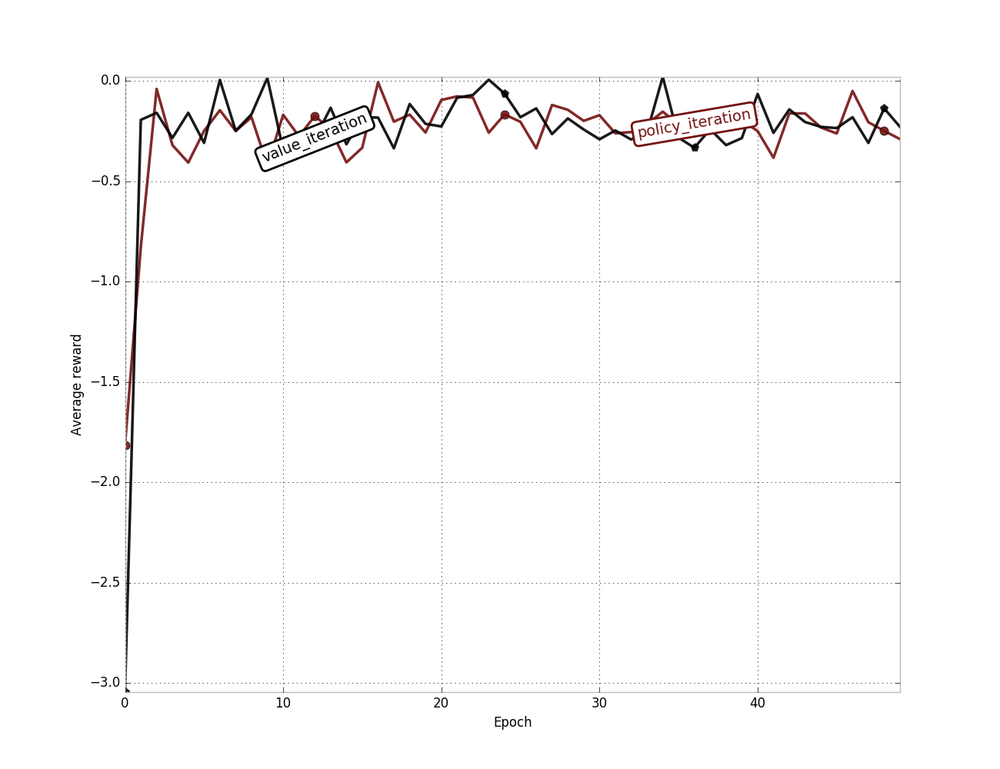

Run `python main.py` to evaluate policy iteration and value iteration algorithms on a 5x5 grid world problem.

- The policy iteration is implemented according to [link](http://webdocs.cs.ualberta.ca/~sutton/book/4/node4.html); and
- the value iteration algorithm is implemented according to [link](http://webdocs.cs.ualberta.ca/~sutton/book/4/node5.html)

Both algorithms are implemented here: [algorithms.py](algorithms.py)

The grid world problem has 5 rows and 5 columns and there are 4 terminal states whose rewards are shown in the matrix below:

```
[[ 0.  0.  0.  0.  1.]
 [ 0.  0. -1. -1.  0.]
 [ 0.  0.  0.  0.  0.]
 [ 0.  0.  0.  0.  0.]
 [ 0.  0.  0.  0.  1.]]
```

The agent's start position is at the top-left corner. If the agent moves right, there is an equal probability 
that the agent ends up moving right (see `get_successive_states` function in [grid_world.py](grid_world.py)).
If the agent lands in a state where the reward is 1 or -1 then the game terminates. There is a -0.005 reward 
for every step the agent takes in the grid world.

The optimal policy achieved should look like this, where the direction of the arrows represent where the 
agent should be going at each state.

```
[['>' '>' '^' '>' 'v']
 ['v' '<' '>' '>' '>']
 ['v' 'v' 'v' 'v' '>']
 ['v' '>' '>' '>' '>']
 ['^' '>' '>' '>' '^']]
 ```
 The average reward results between policy iteration and value iteration should look similar to this:
 
 

To get a nice-looking plot, install pretty-plots with pip:
 `pip install pretty-plots`
