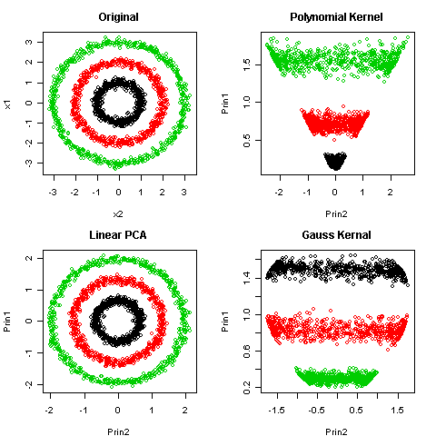
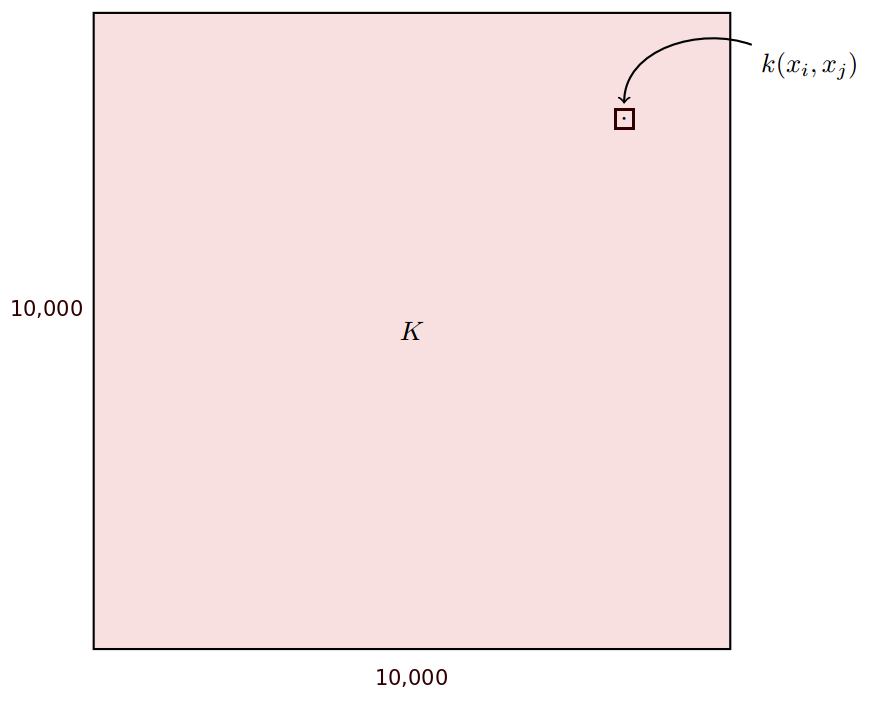
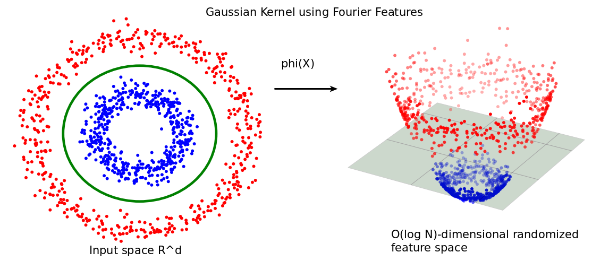

# Large Scale Kernel methods

* Speaker: Issam Laradji
* MLRG

# Outline

* Introduction to kernel methods

* Low rank approximation
    * Nystrom approximation
    
* Random Fourier Features
    * Random Kitchen Sink
    * Fastfood


# Kernel

* Dataset $X \in R^{N \times D}$ 
    * $N$ samples, $D$ features
    
* A similarity function that takes two input vectors and spits out their similarity $$K(X_i, X_j) = \phi(X_i) \cdot \phi (X_j) $$

* $\phi(X_i)$ is the feature representation of $X_i$ in the higher dimensional space (possibly infinite)
    * Need not be explicitly computed


* Why kernels ?
    *  $\phi(X_i) \cdot  \phi(X_j)$ may have high dimensional complexity
    * $\phi(X_i) \cdot  \phi(X_j)$ might be impossible to compute.
        * Gaussian Kernel: $\phi(X_j)$ projects $X_j$ to infinite dimensions
    
# Kernel




# Example

* Gaussian Kernel:
    * As, $K(X_i, X_j) = e^{-\frac{||X_i -X_j||^2}{2 \sigma^2}}$
    * Also as, $K(X_i, X_j) = e^{-\frac{X_i \cdot X_j}{ \sigma^2}}$
    * which is $K(X_i, X_j) = \sum_{n=0}^\infty \frac{(X_i \cdot X_j)^n }{\sigma^n n!}$ 
 * Gaussian kernel is a combination of all polynomial kernels of degrees  $n \geq 0$
 * It's an infinite power series which converges 


# Kernel-based algorithms
* Dataset $X \in R^{N \times D}$, $y \in R^N$
    * N samples, D features
    
    
* SVMs, Kernel Ridge Regression, Gaussian Process Regression


* A Kernel matrix is a Gram matrix $K \in R^{N \times N}$


* Linear function expansion is $$f(x) = \sum_i w_i K(X_i, X)  $$


* Therefore, number of basis functions increases linearly in the number of observations


* Kernel Ridge Regression $$w = [K + \lambda I]^{-1} z y$$ 
    * where $z_i = K(X_i, X)$
    
    
* Computational cost for large-scale problems
    * $\Omega(N^2)$ space.
    * $O(N^3)$ time for matrix inversion or SVD


# Example
* Inverting a large matrix with N = 18M
 * $K \approx 1300$ TB
 * $320,000 \times 4$  GB RAM machines


# Two main strategies 

* Sampling-based low-rank approximation:
    * Compute and store only $T << N$ columns of $K$
    * Column-sampling using Nystrom method
    
    
* Explicit feature expansion (Fast feature extraction):
    * Fourier random features
    * Random Kitchen Sink, Fastfood
    


# Original Nystrom Approximation
* Positive definite symmetric matrix $K \in R^{N \times N}$


* Computing the inverse - SVD on very large datasets can become prohibitive quickly for large N $O(N^3)$


* The Nystrom method is an efficient technique for the eigenvalue decomposition of large kernel matrices


# Algorithm
- Input : Gram matrix K $\in R{N \times N}$ 

- Result : $\hat{K} \in R^{N \times N}$ 


1. Pick $T$ columns of $K$ in i.i.d trials, uniformly with replacement

2. Let $I$ be the set of indices of the sampled columns

3. Let $C$ be the $N \times T$ matrix containing the sampled columns

4. Let $H$ be the $T \times T$ submatrix of $K$ whose entries are $K_{ij}$, $i \in I$, $j \in I$

5. Return $\hat{K} = C H^{-1} C$
  

  
* Computes an approximation $\hat{K} \approx K$

* Computing SVD of $H$ $$O(T^3)$$


* Computing $\hat{K}$ $$O(N \cdot T \cdot k)$$ 
    * where $k$ is the best rank-k approximation of $K$
    * $k \leq T$


# Nyström Woodbury Approximation 

* Kernel ridge regression $$w = [K + \lambda I]^{-1} z y$$  


* Computing $\underbrace{[K + \lambda I]^{-1}}_{O(N^3)}$


* Matrix inversion lemma
$$
\begin{aligned}
 (K + \lambda I)^{-1} &\approx (\hat{K} + \lambda I)^{-1}\\
 &= ( C H^{-1} C^T + \lambda I)^{-1} \\
 &= \frac{1}{\lambda}(I - C(\lambda I +  H^{-1} C^TC)^{-1}H^{-1}C^T)\\
  &= \frac{1}{\lambda}(I - C(\underbrace{\lambda I +  H^{-1} C^TC)^{-1}}_{O(T^3)}H^{-1}C^T)\\
\end{aligned}
$$


* Inverting a $T \times T$ matrix instead
    
    
(Williams & Seeger, 2000)


# Approximation Error
Drineas & Mahoney (2005) 

### Theorem 1:
* Let $\hat{K}$ be the best rank-k approximation of $K$


* Let $b = 1 + \sqrt{8 \log(1/\delta)}$


* Let $\epsilon$ be a small value larger than 0


* If $T \geq 4 b^2 / \epsilon^2$, then with probability at least $1-\delta$


$$E[||K - \hat{K}||_F] \leq ||K-\hat{K}||_F + \epsilon \sum_{i=1}^N K_{ii}^2$$


# Example

* MNIST Dataset 
    * 20000 taining examples and 10000 test examples.


# Applications
* Examples
    * Spectral Clustering (Fowlkes et al., 2004).
    * Kernel Ridge Regression (Cortes, MM, and Talwalkar, AISTATS 2010).
    * Support Vector Machines (Fine and Scheinberg, 2001).
    * Kernel Logistic Regression (Karsmarker et al., 2007).
    * Manifold Learning (Kumar and Talwalkar, 2008)

# Extensions on Nystrom

* We discussed unifom sampling of columns


* Other sampling methods include:
    * $l2$ norm of the columns
    * Non-uniformly $\propto$ diagonal elements $K_{ii}$
    
    
* Empirical results:
    * uniform sampling without replacement: best results
      and fastest for real-world datasets
        (Kumar, MM, and Talwalkar, 2009).
        
        
* Found to work great for sparse optimization
   $$\min_w \frac{1}{2n}||y-Kw||^2_2 + \lambda ||w||_1$$
   
  


# 2.  Fourier Random Features

* Linear decision surface over the kernelized form, 
$$f(x) = \sum_{i=1}^N w_i K(X_i, X)$$

* The Gram matrix $K$ can be too large (10,000, 10,000)

{ width=50% }

# 2.  Fourier Random Features


* Linear decision surface over the kernelized form, 
$$f(x) = \sum_{i=1}^N w_i K(X_i, X)$$

* $K(X_i, X_j) = \phi(X_i) \cdot \phi(X_j)$


* Main Idea: Compute an approximated representation of $\phi(X_i)$
    * has $O(\log N)$ dimensional space


* Instead of computing $K \in R^{N \times N}$, compute $\phi(X) \in R^{N \times \log (N)}$


* For 10,000 images, $\log_{10}(10^4) = 4$

* Exact computation of $\phi(X)$

{ width=50% }


# 2.  Fourier Random Features


* Compute an approximation $\phi_z(X) \approx \phi(X)$ explicitly

{ width=50% }


* $K(X_i, X_j) = \phi(X_i) \cdot \phi(X_j)$


* Compute $\phi_z(X_i) \cdot \phi_z(X_j)$ such that 
    $$E_z[\phi_z(X_i) \phi_z(X_j)] = K(X_i, X_j)$$
    
# 2.  Fourier Random Features

  
    
* Let K be a translation invariant kernel, that is, $$K(X_i, X_j) = K(X_i - X_j, 0) $$

    * such as the gaussian kernel
    
    

* Bochner’s Theorem:  A kernel $K(X_i - X_j)$ is PSD iff $K(X_i - X_j)$
is the Fourier transform of a non-negative measure $p(z)$ 

$$K(X_i - X_j, 0) = \int_R e^{-i z (X_i - X_j)} p(z) dz$$

* where $p(z)$ is a positive finite measure which is when scaled is a proper probability distribution.

# 2.  Fourier Random Features

* Therefore,
$$
\begin{aligned}
  k(X_i,X_j) &= k(X_i-X_j,0 )\\
  &= \int_{R^d} p(z) e^{z(X_i-X_j)}dz \\
  &\approx \frac{1}{T} \sum_{i=1}^T e^{jz_i(X_i-X_j)} & z_i \sim p(z) \;\; \text{iid,    Monte-Carlo},O(T^{-1/2})\\
  &=\frac{1}{T} \sum_{i=1}^T e^{j z_i X_i} e^{-jz_iX_j}\\
  &= \frac{1}{\sqrt{T}}\phi_z(X_i) \frac{1}{\sqrt(T)}\phi_z(X_j)\\
\end{aligned}
$$


# 2.  Fourier Random Features


* To compute $e^{j  z_i X_i }$, use the cosine identity $$e^{\pm j\theta} = cos(\theta) \pm j sin(\theta)$$


* $k(X_i-X_j)$ is a real-value of  $e^{i z_i(X_i-X_j)}$


* The real-value of $e^{i (X_i-X_j)Z}$ is $cos (X_i-X_j)Z$


* Two mapping of this exist as estimation:

  1. $\phi_z(X) = [\cos(XZ) \;\;\sin(XZ)]$
      * This is a vector

  2. $\phi_z(X) = \sqrt{2} \cos(XZ + b)$ 
      * where b is drawn uniformly from $[0, 2 \pi]$   


# Overall

* Let $X$ be the dataset $\in R^{N \times D}$
* Let $y$ be the target values $\in R^{N}$


1. Greedy Fitting $$(W^\star, Z^\star) = \min_{W, Z}  \lVert\sum_{i=1}^Tw_i \phi_z(X_i)-y\rVert_F$$

2. Random Kitchen Sinks Fitting $$z_1^\star, z_2^\star, ..., z_T^\star \sim p(w), \;\;\; W^\star = \min_W ||\sum_{i=1}^Tw_i \phi_z(X_i)-y||_F$$


# 1. Greedy method


* Inputs: y, probability measure $\mu$
* Output $w_1, w_2,...,w_T, z_1,z_2,...,z_T$ so that  $$f(x) = \sum_{i=1}^\infty w_i \phi(x;z_i) \approx f_T(x) = \sum_{i=1}^Tw_i \phi(x;z_i)$$


        
1. Initialize $f_0(x) = 0$
2. for $t=1,2,...,T$
    * $(z_t, w_t) = arg \min_{w_t, z_t} ||(1-w_t)f_{t-1} + \alpha_t \phi_{z_t}(x) - y||_F$ 
    * $f_t \leftarrow f_{t-1} + \alpha_t \phi_{z_t}(X)$


# 2. Random Kitchen Sink method


* Inputs: y, probability measure $p$
* Output $w_1, w_2,...,w_T, z_1,z_2,...,z_T$ so that  $$f(x) = \sum_{i=1}^\infty w_i \phi(x;z_i) \approx f_T(x) = \sum_{i=1}^Tw_i \phi(x;z_i)$$


        
1. Draw $z_1, z_2,...z_T \sim p(z)$


2.  $w \leftarrow arg \min_w || \sum_{i=1}^T w_t \phi_z(X) - y||_F$


# 2. Random Kitchen Sink method in Python

```python
# Random Kitchen Sink method

# Fit a Gaussian Process using kernel approximation
import numpy as np

# Stage 1. Get the random features
# 1. N samples and D features
N, D = 100,50

# 2. Create Synthetic dataset
X = np.random.randn(N, D)
y = np.random.rand(N, 1)

# 3. Sample T from p(z)
T = 10
gamma = 1.
Z = (np.sqrt(2 * gamma) * np.random.randn(D, T))

# 4. Project X
phi = np.dot(X, Z)
b = np.random.uniform(0, 2 * np.pi, T)
phi += b
phi = np.cos(phi)
phi *= np.sqrt(2.) / np.sqrt(T)

# Stage 2. Fit ridge regression on the features
y_new = np.dot(phi.T, y)
lambda_ = 1./ D
W = (np.linalg.pinv(np.dot(phi.T, phi) + 
                     np.identity(T) * lambda_)) * y_new
```


# Fastfood

$D$ dimension, $T$ random features, $N$ datapoints

* Sample $D \times T$ random numbers : $Z \sim N(0, \sigma^{-2})$


* $\phi_z(X_i) =  e^{(- i X_i Z)}$


* Computing the features $\phi_z(\cdot)$ for every datapoint is $O(NDT)$


* Fastfood - using Hadamard transform we can reduce the time complexity for computing the features to $O(\log(D)NT)$


* For images, if $D = 10, 000$, $log_{10}(D) = 4$.

# Fastfood

* Main idea: Compute $XZ \approx XV$
* V has similar properties to the Gaussian matrix Z

 $$V = \frac{1}{\sigma \sqrt{N}} S H G P H B$$

* P is a N x N permutation matrix
* G is a diagonal random Gaussian
* B is a diagonal random {+1, -1}
* S is a diagonal random scaling
* H is Walsh- Hadamard matrix


# More details

* Binary scaling matrix B: 
    * It is a diagonal matrix  with $Bii \in {\pm 1}$ drawn iid. 


* Permutation P:
    * can be generated by sorting random numbers.


* Gaussian scaling matrix G: 
    * This is a diagonal matrix  whose elements $Gii \tilde N (0, 1)$ are drawn iid from a Gaussian. 

* Scaling matrix S:
    * Gaussian case S ensures that the length distribution of the row of V are independent of each other.


# More details
<!-- font: helvetica -->

* Main idea: Compute $XZ \approx XV$
* V has similar properties to the Gaussian matrix Z

 $$V = \frac{1}{\sigma \sqrt{N}} S H G P H B$$

* S H G P H B produces pseudo-random Gaussian vectors
* S fixes the lengths to have the correct distribution


# Fastfood in python

```python
# Fast food

# Fit a Gaussian Process using kernel approximation
import numpy as np

# Stage 1. Get the random features
# 1. N samples and D features
N, D = 100,50

# 2. Create Synthetic dataset
X = np.random.randn(N, D)
y = np.random.rand(N, 1)

# 3. Sample T from p(w)
T = 10
gamma = 1.
Z = (np.sqrt(2 * gamma) * np.random.randn(D, T))

# 4. Project X
# Add fastfood approximation
V = get_hadamard_representation(Z)
phi = np.dot(X, V)
b = np.random.uniform(0, 2 * np.pi, T)
phi += b
phi = np.cos(phi)
phi *= np.sqrt(2.) / np.sqrt(T)

# Stage 2. Fit ridge regression on the features
y_new = np.dot(phi.T, y)
lambda_ = 1./ D
W = (np.linalg.pinv(np.dot(phi, phi.T) + 
                     np.identity(N) * lambda_) * y_new)

```

# Analysis - Random Kitchen sink

* Computing Features $\phi(x) = \frac{1}{\sqrt{T}} \exp(iZX)$


* Regression: $$w = [\phi(x)^T \phi(x)]^{-1} \phi(x)^T y$$


* Train time complexity

$O(\underbrace{NTD}_\text{Computing Random Features}  + \underbrace{T^3}_\text{Inverting Covariance matrix} + \underbrace{T^2N}_\text{Multiplication} )$

* Prediction: $y^* = w^T \phi(x^*)$


* Test time complexity: $O(\underbrace{N^*TD}_\text{Computing Random Features} + \underbrace{T^2N^*}_\text{Multiplication} )$


# Analysis - FastFood

* Computing Features $\phi(x) = \frac{1}{\sqrt{T}} \exp(iVx) \approx \frac{1}{\sqrt{T}} \exp(iZx)$
* regression: $$w = [\phi(x)^T \phi(x)]^{-1} \phi(x)^T y$$
* FF Train time compleixty
$O(\underbrace{\log(N)TD}_\text{Computing Random Features}  + \underbrace{T^3}_\text{Inverting Covariance matrix} + \underbrace{T^2N}_\text{Multiplication} )$


*  RKS Train time complexity
$O(\underbrace{NTD}_\text{Computing Random Features}  + \underbrace{T^3}_\text{Inverting Covariance matrix} + \underbrace{T^2N}_\text{Multiplication} )$


* Prediction: $y^* = w^T \phi(x^*)$


* Test time complexity: $O(\underbrace{\log(D)TN^*}_\text{Computing Random Features} + \underbrace{T^2N^*}_\text{Multiplication} )$


* For images, if N = 10, 000, log10(N) = 4

# Analysis - FastFood


# Analysis - FastFood

* MNIST Dataset 
    * 20000 taining examples and 10000 test examples.


