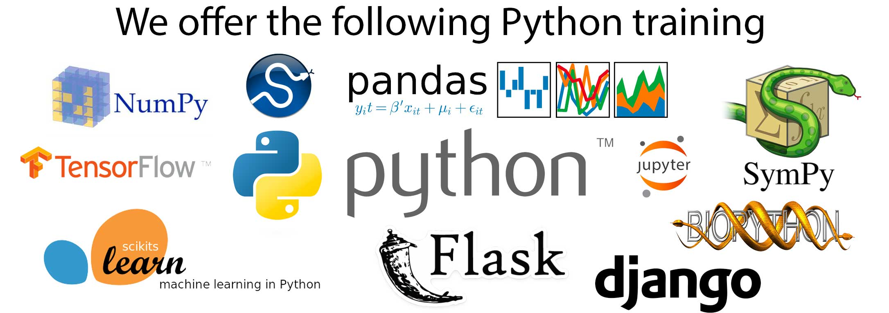

# Python Introduction

Why Python ?

* General-purpose programming language (Batteries included)




# Python Introduction

Why Python ?

* General-purpose programming language (Batteries included)
* Emphasizes Readability and on Productivity

```python
print "Hello World!"

```

# Python Introduction

Why Python ?

* General-purpose programming language (Batteries included)
* Emphasizes Readability and on Productivity

```python
def f(x):
    return x**3

print f(2)
```

# Python Introduction

Why Python ?

* General-purpose programming language (Batteries included)
* Emphasizes Readability and on Productivity
* It's free!


* Python 2.7 is the recommended version
* Python 3.0 adoption will take some time

# Python Introduction


\begin{figure}[h]
\caption{Python 2.7 is the recommended version}
\centering
\includegraphics[width=0.9\textwidth]{images/273.pdf}
\end{figure}


# Outline

* Hands-on experience
    * Python Fundamentals
    * Data Manipulation and classification

* Future
    * Machine Learning 
    * Computer Vision


# First steps

Is python (Anaconda) installed ?

* Type python in command prompt or terminal

# First steps

Is python (Anaconda) installed ?

* Type python in command prompt or terminal

\begin{figure}[h]
\centering
\includegraphics[width=0.9\textwidth]{images/terminal.png}
\end{figure}

# First steps

Launch Jupyter

* Type the following in command prompt or terminal

```python
> jupyter notebook
```

# Main types

## 1. Integers

```python
a = 3
b = 5

print a + b
```

## 2. Float

```python
a = 3.56
b = 5.23

print a + b
```

# Main types

## 3. String

```python
name = "Hello World"

print name
```

# Importing libraries

```python
import numpy as np

np.log(3)
np.exp(5)
np.array([3,2,1])
```

```python
import pylab as plt

plt.scatter([1,2,3,4], [1,2,3,4])
```

# Data Science

* The term "data science" has exploded in business environments

\begin{figure}[h]
\centering
\includegraphics[width=0.9\textwidth]{images/data_science.jpg}
\end{figure}

# Data Science

* Many academics and journalists see no distinction between data science and statistics
\begin{figure}[h]
\centering
\includegraphics[width=0.9\textwidth]{images/data_science.jpg}
\end{figure}

# Data Science

**Nate Silver**

* Sexed-up term for statistics. Statistics is a branch of science. Data scientist is slightly redundant in some way and people shouldn’t berate the term statistician

\begin{figure}[h]
\centering
\includegraphics[width=0.7\textwidth]{images/data_science.jpg}
\end{figure}


# Data Science


* Find and interpret rich data sources

* Create visualizations to aid in understanding data

* Data Scientists are people who turn data into applications

\begin{figure}[h]
\centering
\includegraphics[width=0.9\textwidth]{crime.png}
\end{figure}

# Data Science


* Find and interpret rich data sources

* Create visualizations to aid in understanding data

* Data Scientists are people who turn data into applications

\begin{figure}[h]
\centering
\includegraphics[width=0.9\textwidth]{crime.png}
\end{figure}

# Data Science


* Find and interpret rich data sources

* Create visualizations to aid in understanding data

* Data Scientists are people who turn data into applications

\begin{figure}[h]
\centering
\includegraphics[width=0.9\textwidth]{cars.png}
\end{figure}

# Data Science


* Find and interpret rich data sources

* Create visualizations to aid in understanding data

* Data Scientists are people who turn data into applications

\begin{figure}[h]
\centering
\includegraphics[width=0.9\textwidth]{titanic.jpg}
\end{figure}

# Data Science


\begin{figure}[h]
\centering
\includegraphics[width=0.4\textwidth]{decision_tree.png}
\end{figure}


\begin{figure}[h]
\centering
\includegraphics[width=0.6\textwidth]{titanic.jpg}
\end{figure}


# Python libraries for data science

* Pandas (for data manipulation and visualization)

\begin{figure}[h]
\centering
\includegraphics[width=0.7\textwidth]{images/pandas.png}
\end{figure}


* Scikit-learn (for machine learning)

\begin{figure}[h]
\centering
\includegraphics[width=0.7\textwidth]{images/sklearn.png}
\end{figure}


# Titanic Dataset

**On April 15, 1912**

* the Titanic sank after colliding with an iceberg
    * killing 1502 out of 2224 passengers and crew. 
    * There were not enough lifeboats for the passengers and crew.

 * Some groups of people were more likely to survive than others, such as women, children, and the upper-class.

**Task**

* What sorts of people were likely to survive ?

* Use Data Science or Machine Learning to predict which passengers survived the tragedy.


# Titanic Dataset

<!-- * Download link: https://drive.google.com/file/d/0B_zc7Ms0TN60SC1ybmk0ekpId2M/view -->


\begin{figure}[h]
\centering
\includegraphics[width=1.2\textwidth]{dataset.png}
\end{figure}


* Download link: goo.gl/oF5GBc

# Sklearn 

\begin{figure}[h]
\centering
\includegraphics[width=1.0\textwidth]{ml_map.png}
\end{figure}

